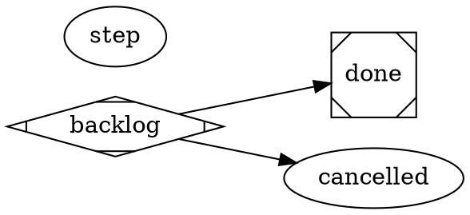

# satelle parent workflow — close when the children are done

A **container** story — a `parent` or `epic-parent` — has no slice of its own to
implement; its work IS the child stories under it. So its lifecycle is minimal,
authored in the **DOT standard** (node-centric — see the `satelle-agent-model`
principle): it moves **backlog → done**, and may exit early to **cancelled**.
There is deliberately no `in_progress`/`integration`/`commit_push` step — nothing
is built on the parent itself.

The close is the only gate that matters, and it is the **mandatory spine gate**
`satelle-story-done-review` (every workflow's edge into `done` carries it). That
reviewer is **category-aware**: for a `parent`/`epic-parent` it does not judge the
parent's own acceptance criteria — a container's work is its children — but
instead accepts the close ONLY when **every child story is resolved** (`done` or
`cancelled`), judging the children from the close-gate payload (satelle resolves
them from the database). So a parent cannot close while a child is still open; the operator
finishes or cancels the children first. See [[satelle-done-is-last]] and
[[satelle-agent-model]].



## Environment

```yaml
guardrails:
  always:
    - A parent/epic closes only when every child story is done or cancelled — finish or cancel the children first.
    - Drive a container to a terminal state (done or cancelled); don't leave it open once its children are resolved.
  ask_first: []
  never:
    - Place any state after done — done is always the terminal success state.
    - Self-enact the close the reviewer has not accepted, or close a parent with an unresolved child.
```
