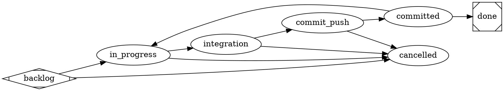

# satelle workflow (project) — the actor model, authored in DOT

> **This is a project workflow** under `.satelle/workflows`, the ACTIVE workflow
> for this repo: a project-scope workflow takes precedence over the binary's
> embedded **system** default `satelle-baseline-workflow`. See the
> `satelle-repo-agnostic` and `satelle-actor-model` principles.

A work item moves **backlog → in_progress → integration → commit_push → committed →
done**, and may exit early to **cancelled**. The lifecycle is the **DOT graph** below
(node-centric): each node is a step carrying an `actor`; the **executor** does the
work and mutates the tree, and a **reviewer** node gates *entry* to it via its
`prompt="@skill:NAME"` gate (the reviewer is read-only — it judges, never mutates).
satelle is the gatekeeper of status: a status advances only through a reviewer's
accept.

The release path is deliberate. There is **no deploy state** — pushing to `main`
IS the release, and CI is the deployment check. The **integration** step is the
test stage: entering it from `in_progress` is gated by `satelle-code-ac-review` —
a read-only reviewer that the implemented code satisfies the story's acceptance
criteria AND that both unit and integration tests were created. Leaving it for
`commit_push` is gated by `satelle-integration-review` — a reviewer that the
integration tests actually exercise the change — alongside `satelle-integration-check`,
an always-on functional gate that runs the local suite (`make integration`) and
rejects on a red run. So the slice is reviewed, its tests are executed, and those
tests are reviewed, all before anything is committed. The **commit_push** executor step
commits and pushes the slice and watches the GitHub Actions run to conclusion
(skill `commit-push`); the **committed** gate (`satelle-commit-push-review`, a
functional check) confirms that CI run concluded success and emits a PR-style
commit-summary; the **done** gate (`satelle-story-done-review`) checks the
acceptance criteria. If the **done** gate rejects, the `committed -> in_progress`
recovery edge returns the story to work so it can fix the rejected slice and
re-traverse to `done` — the gate is acted on, not bypassed. The commit happens while
the story is **engaged** (an executor state), so commits are always tracked. The
always-on system layer still applies: a plan estimate is required entering
`in_progress` and the actual entering `done`.



## Skill resolution

Every gate/skill this workflow names resolves through the doc-index, **project
scope (`.satelle/skills`) layered over the embedded system defaults**. The
executor step `commit-push` and the reviewer gates (`satelle-code-ac-review`,
`satelle-integration-review`, `satelle-commit-push-review`,
`satelle-story-intent-review`, `satelle-story-done-review`,
`satelle-story-cancel-review`) are authored in this repo's `.satelle/skills` — so
there is no dangling `@skill:`/`reviewer_skill` reference and a story drives to a
terminal state without a missing-skill block. The engagement guard
(`sty_09ef53d6`) deterministically resolves the **executor-step** skills on the
path to done before work begins; reviewer gates degrade to advisory only if their
rubric is genuinely absent. The embedded **baseline** workflow remains the
order-zero fallback: it names the same gate reviewers but, being repo-agnostic,
relies on a repo authoring them — a fresh repo's baseline still completes (its
absent gates degrade to advisory) until the repo adds its own.

## Environment

```yaml
guardrails:
  always:
    - Drive an engaged item to a terminal state (done or cancelled) — don't leave work open indefinitely.
    - Give a story/task numbered acceptance criteria before starting, and satisfy them before moving to done.
    - Commit and push at the commit_push step (an executor state); the committed gate verifies the CI run before close.
  ask_first: []
  never:
    - Place any state after done — done is always the terminal success state.
    - Self-enact a gated edge the reviewer has not accepted.
    - Mark an item done with unmet acceptance criteria, or advance committed with a failing CI run.
```
