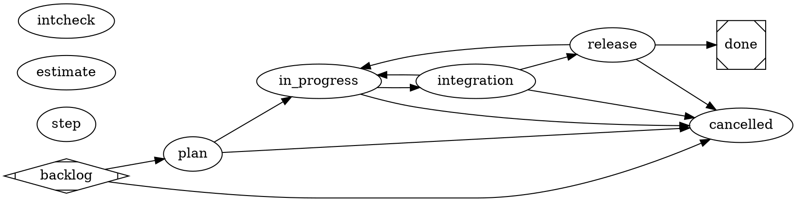

# satelle workflow (project) — the agent model, authored in DOT

> **This is a project workflow** under `.satelle/workflows`, the ACTIVE workflow
> for this repo: a project-scope workflow takes precedence over the binary's
> embedded **system** default `satelle-baseline-workflow`. See the
> `satelle-repo-agnostic` and `satelle-agent-model` principles.

The lifecycle is the **DOT graph** below — read it as the authority; this prose
only orients and must not restate it. Each node is a step carrying an `agent`.
This workflow is **reviewer-first** (a reviewer gates every transition) and
**splits execution by stage** (sty_5d9648f2, reversing sty_d9a0b573 for
`in_progress` only): `in_progress` is a **dispatched, isolated sonnet worker**
(`agent=worker`), while `integration` and `release` carry `agent=executor`, so the
**in-loop driving session** performs *those* tree-touching steps with full context
and the session's own permissions — no isolated sub-process is spawned for
integration/commit/push, which is what previously lost context and hit
narrow-grant permission walls. A **reviewer** node only gates *entry* via its
`prompt="@skill:NAME"` (read-only — it judges, never mutates). Status advances only
through a reviewer's accept. The gating begins at intake: `backlog -> plan` is
gated by `satelle-story-intent-review`, so a story must earn entry to planning —
well-formed, UI-agnostic, non-colliding, architecturally sound, and YAGNI — before
any dispatch spends tokens on it. A reject leaves the story at `backlog` to be
fixed and re-requested (or cancelled via `backlog -> cancelled`).

**Two steps dispatch.** `plan` is allocated to a named agent (`agent=planner`, a
cheap FABLE model in `.satelle/agents.toml`) that reads the story, writes an
implementation plan covering every acceptance criterion, and attaches it to the
story. `in_progress` is then allocated to the isolated **sonnet worker**
(`agent=worker`, `@skill:code`): reached from the *performing* `plan` state, it
reconstructs context from the story + attached plan via the read-only CLI, implements
exactly the plan's slice with unit + integration tests, and stops for the
`code-ac-review` gate — so the code slice is written by a focused isolated agent on
the same rigorous model as the reviewer, while the driving session keeps the
integration/release stages. Reaching the worker from the performing `plan` state is
what lets the dispatch lock-guard legitimately allow its edits.

Two things the edges don't show. **There is no deploy state** — pushing to `main`
IS the release, verified by CI. And the **always-on gates are declared, not
injected**: the edge-less reviewer nodes `estimate` (`on="in_progress,done"`) and
`intcheck` (`on="release"`) run on the transitions their `on=` names, so the DOT is
the sole gating authority. `estimate` requires a plan estimate entering
`in_progress` and an actual entering `done`; `intcheck` runs `make integration` on
entry to `release` (the `integration -> release` edge), alongside that edge's
`satelle-integration-review` — so `integration` is a **visible testing step**, not a
gate hidden inside another transition (sty_15dbc0dd). The `integration -> in_progress`
and `release -> in_progress` edges are recovery: a reject returns the story to work
to fix and re-traverse, never bypass.


```dot
digraph satelle_workflow {
  graph [goal="Drive a story to done — plan reviewed against the ACs, implemented in-loop, released and verified by CI, every gate accepted", vars="story, repo_root"]
  rankdir=LR

  backlog     [shape=Mdiamond]
  plan        [agent=planner, prompt="@skill:plan"]   // DISPATCHED to the fable planner
  in_progress [agent=worker, prompt="@skill:code"]      // DISPATCHED to the isolated sonnet worker (reached from performing plan)
  integration [agent=executor]                          // in-loop: the testing stage — make integration runs on exit
  release     [agent=executor]                          // in-loop: the session commits+pushes+records
  done        [shape=Msquare]                           // terminal (release-review gates the edge in)
  cancelled   [agent=reviewer, prompt="@skill:satelle-story-cancel-review"]

  // step opts this workflow into per-transition step summaries (sty_9a139c78):
  // an edge-less declaration, mandatory so a summary failure is surfaced.
  step        [agent=reviewer, prompt="@skill:satelle-step-summary", mandatory=true]

  // Declared scoped reviewers (edge-less, on="<target states>"): always-on gates the
  // workflow itself declares. estimate gates begin-work + close; intcheck runs
  // `make integration` on entry to release — i.e. on the integration -> release edge,
  // alongside that edge's satelle-integration-review — so integration is a VISIBLE step.
  estimate    [agent=reviewer, prompt="@skill:satelle-estimate-actual-review", on="in_progress,done"]
  intcheck    [agent=reviewer, prompt="@skill:satelle-integration-check", on="release"]

  backlog     -> plan         [agent=reviewer, prompt="@skill:satelle-story-intent-review"] // intake gate: a story must pass intent-review to enter plan
  plan        -> in_progress  [agent=reviewer, prompt="@skill:satelle-story-plan-review"]
  in_progress -> integration  [agent=reviewer, prompt="@skill:satelle-code-ac-review"]     // code matches the ACs -> enter integration
  integration -> release      [agent=reviewer, prompt="@skill:satelle-integration-review"] // tests adequate (+ scoped intcheck runs make integration) -> enter release
  release     -> done         [agent=reviewer, prompt="@skill:satelle-story-release-review"]

  integration -> in_progress  // recovery: a test/review reject returns to work
  release     -> in_progress  // recovery: a release/done reject returns to work

  backlog     -> cancelled
  plan        -> cancelled
  in_progress -> cancelled
  integration -> cancelled
  release     -> cancelled
}
```

## Skill resolution

Every gate/skill this workflow names resolves through the doc-index, **project
scope (`.satelle/skills`) layered over the embedded system defaults**. The
dispatched `plan` (`@skill:plan`) and `in_progress` (`@skill:code`, the sonnet
worker) rubrics, the in-loop `release` executor rubric, and the reviewer gates
(`satelle-story-intent-review`, `satelle-story-plan-review`, `satelle-code-ac-review`,
`satelle-integration-review`, `satelle-integration-check`,
`satelle-story-release-review`, `satelle-estimate-actual-review`,
`satelle-story-cancel-review`, `satelle-step-summary`) are authored in this repo's
`.satelle/skills` — so there is no dangling `@skill:` reference
and a story drives to a terminal state without a missing-skill block. Reviewer
gates degrade to advisory only if their rubric is genuinely absent.

## Environment

```yaml
guardrails:
  always:
    - Drive an engaged item to a terminal state (done or cancelled) — don't leave work open indefinitely.
    - Give a story numbered acceptance criteria before starting, and satisfy them before moving to done.
    - Perform integration and release IN-LOOP as the driving session; plan and in_progress are the dispatched steps (in_progress is the isolated sonnet worker).
    - Bump the version + commit + push + record the release in the single in-loop release step; the release gate verifies the bump, CI, the published release, and the acceptance criteria before close.
  ask_first: []
  never:
    - Place any state after done — done is always the terminal success state.
    - Self-enact a gated edge the reviewer has not accepted.
    - Mark an item done with unmet acceptance criteria, or release with a failing CI run.
    - Spawn an isolated sub-process to perform integration or release — those stages are in-loop; only plan and in_progress dispatch.
```
