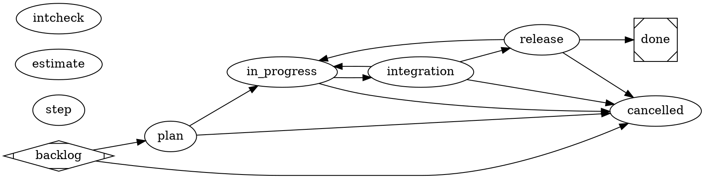

# satelle workflow (project) — the agent model, authored in DOT

> **This is a project workflow** under `.satelle/workflows`, the ACTIVE workflow
> for this repo: a project-scope workflow takes precedence over the binary's
> embedded **system** default `satelle-baseline-workflow`. See the
> `satelle-repo-agnostic` and `satelle-agent-model` principles.

The lifecycle is the **DOT graph** below — read it as the authority; this prose
only orients and must not restate it. Each node is a step carrying an `agent`.
This workflow is **reviewer-first** (a reviewer gates every transition) and
**dispatches every performing stage** to an isolated named agent on SONNET:
`plan` to the read-only `planner`, and `in_progress`, `integration`, and `release`
all to the code-writer `worker`. The driving session **orchestrates transitions and
lets the gates judge — it performs no step itself**. Each performer is reached from a
*performing* state, so the dispatch lock-guard allows its edits (it grants that only
when the FROM status is engaged): `in_progress` from `plan`, `integration` from
`in_progress`, `release` from `integration` (which is itself performing once it
carries `agent=worker`). `plan` runs on its own read-only binding because it is
entered from the non-performing `backlog` state, and the lock-guard refuses a
code-writer dispatched from a non-performing state — so plan cannot share `worker`.
The `[worker]` binding carries the **complete** grant every performing rubric runs —
go/gofmt/make, git+gh, satelle, Edit/Write — so no step hits a permission wall and
returns a false OK (the isolated-commit lesson that once stranded a story at commit). A **reviewer** node only gates *entry* via its
`prompt="@skill:NAME"` (read-only — it judges, never mutates). Status advances only
through a reviewer's accept. The gating begins at intake: `backlog -> plan` is
gated by `satelle-story-intent-review`, so a story must earn entry to planning —
well-formed, UI-agnostic, non-colliding, architecturally sound, and YAGNI — before
any dispatch spends tokens on it. A reject leaves the story at `backlog` to be
fixed and re-requested (or cancelled via `backlog -> cancelled`).

**Four steps dispatch, all on sonnet.** `plan` is allocated to a read-only named
agent (`agent=planner`, sonnet in `.satelle/agents.toml`) that reads the story, writes
an implementation plan covering every acceptance criterion, and attaches it to the
story. `in_progress`, `integration`, and `release` all share the isolated **sonnet
worker** (`agent=worker`): `in_progress` (`@skill:code`), reached from the *performing*
`plan` state, reconstructs context from the story + attached plan via the read-only
CLI, implements exactly the plan's slice with unit + integration tests, and stops for
the `code-ac-review` gate — the code slice is written by a focused isolated agent on
the same rigorous model as the reviewer. `integration` (`@skill:integrate`) and
`release` (`@skill:release`) then run on the same worker: `integration` runs
gofmt/vet + the unit and integration suites and repairs trivial fallout; `release`
stages the story's slice, bumps `.version`, makes the conventional commit (story id,
no AI attribution), pushes to `main`, and records the CI run conclusions + published
tag as the evidence the release gate judges. Each performer runs on a dispatched
sub-process reconstructing context via the read-only CLI; reaching each from a
performing state is what lets the dispatch lock-guard legitimately allow its edits.
`plan` stays on its own read-only binding because it is entered from the non-performing
`backlog` state, and the lock-guard refuses a code-writer (Edit/Write) dispatched from
a non-performing state — so plan cannot share the worker.

Two things the edges don't show. **There is no deploy state** — pushing to `main`
IS the release, verified by CI. And the **always-on gates are declared, not
injected**: the edge-less reviewer nodes `estimate` (`on="in_progress,done"`) and
`intcheck` (`on="release"`) run on the transitions their `on=` names, so the DOT is
the sole gating authority. `estimate` requires a plan estimate entering
`in_progress` and an actual entering `done`; `intcheck` runs `make integration` on
entry to `release` (the `integration -> release` edge), alongside that edge's
`satelle-integration-review` — so `integration` is a **visible testing step**, not a
gate hidden inside another transition (sty_15dbc0dd). The `integration -> in_progress`
and `release -> in_progress` edges are recovery: a reject returns the story to work
to fix and re-traverse, never bypass.


```dot
digraph satelle_workflow {
  graph [goal="Drive a story to done — plan reviewed against the ACs, implemented in-loop, released and verified by CI, every gate accepted", vars="story, repo_root"]
  rankdir=LR

  backlog     [shape=Mdiamond]
  plan        [agent=planner, prompt="@skill:plan"]   // DISPATCHED to the read-only sonnet planner
  in_progress [agent=worker, prompt="@skill:code"]      // DISPATCHED to the isolated sonnet worker (reached from performing plan)
  integration [agent=worker, prompt="@skill:integrate"]    // DISPATCHED to the sonnet worker: the testing stage — make integration runs on exit
  release     [agent=worker, prompt="@skill:release"]      // DISPATCHED to the sonnet worker: commits+pushes+records CI evidence
  done        [shape=Msquare]                           // terminal (release-review gates the edge in)
  cancelled   [agent=reviewer, prompt="@skill:satelle-story-cancel-review"]

  // step opts this workflow into per-transition step summaries (sty_9a139c78):
  // an edge-less declaration, mandatory so a summary failure is surfaced.
  step        [agent=reviewer, prompt="@skill:satelle-step-summary", mandatory=true]

  // Declared scoped reviewers (edge-less, on="<target states>"): always-on gates the
  // workflow itself declares. estimate gates begin-work + close; intcheck runs
  // `make integration` on entry to release — i.e. on the integration -> release edge,
  // alongside that edge's satelle-integration-review — so integration is a VISIBLE step.
  estimate    [agent=reviewer, prompt="@skill:satelle-estimate-actual-review", on="in_progress,done"]
  intcheck    [agent=reviewer, prompt="@skill:satelle-integration-check", on="release"]

  backlog     -> plan         [agent=reviewer, prompt="@skill:satelle-story-intent-review"] // intake gate: a story must pass intent-review to enter plan
  plan        -> in_progress  [agent=reviewer, prompt="@skill:satelle-story-plan-review"]
  in_progress -> integration  [agent=reviewer, prompt="@skill:satelle-code-ac-review"]     // code matches the ACs -> enter integration
  integration -> release      [agent=reviewer, prompt="@skill:satelle-integration-review"] // tests adequate (+ scoped intcheck runs make integration) -> enter release
  release     -> done         [agent=reviewer, prompt="@skill:satelle-story-release-review"]

  integration -> in_progress  // recovery: a test/review reject returns to work
  release     -> in_progress  // recovery: a release/done reject returns to work

  backlog     -> cancelled
  plan        -> cancelled
  in_progress -> cancelled
  integration -> cancelled
  release     -> cancelled
}
```

## Skill resolution

Every gate/skill this workflow names resolves through the doc-index, **project
scope (`.satelle/skills`) layered over the embedded system defaults**. The
dispatched `plan` (`@skill:plan`, the read-only planner), `in_progress`
(`@skill:code`), `integration` (`@skill:integrate`) and `release` (`@skill:release`) —
the last three all the sonnet worker — rubrics, and the reviewer gates
(`satelle-story-intent-review`, `satelle-story-plan-review`, `satelle-code-ac-review`,
`satelle-integration-review`, `satelle-integration-check`,
`satelle-story-release-review`, `satelle-estimate-actual-review`,
`satelle-story-cancel-review`, `satelle-step-summary`) are authored in this repo's
`.satelle/skills` — so there is no dangling `@skill:` reference
and a story drives to a terminal state without a missing-skill block. Reviewer
gates degrade to advisory only if their rubric is genuinely absent.

## Environment

```yaml
guardrails:
  always:
    - Drive an engaged item to a terminal state (done or cancelled) — don't leave work open indefinitely.
    - Give a story numbered acceptance criteria before starting, and satisfy them before moving to done.
    - Dispatch every performing stage to its named agent on sonnet — plan (read-only planner), in_progress (worker), integration and release (the same worker); the driving session orchestrates transitions and lets the gates judge, performing no step itself.
    - Bump the version + commit + push + record the release in the dispatched worker release step; the release gate verifies the bump, CI, the published release, and the acceptance criteria before close.
  ask_first: []
  never:
    - Place any state after done — done is always the terminal success state.
    - Self-enact a gated edge the reviewer has not accepted.
    - Mark an item done with unmet acceptance criteria, or release with a failing CI run.
    - Perform a dispatched stage (plan, in_progress, integration, release) in-loop instead of letting its named agent run it; the driving session only drives transitions and applies the reviewer gates.
```
