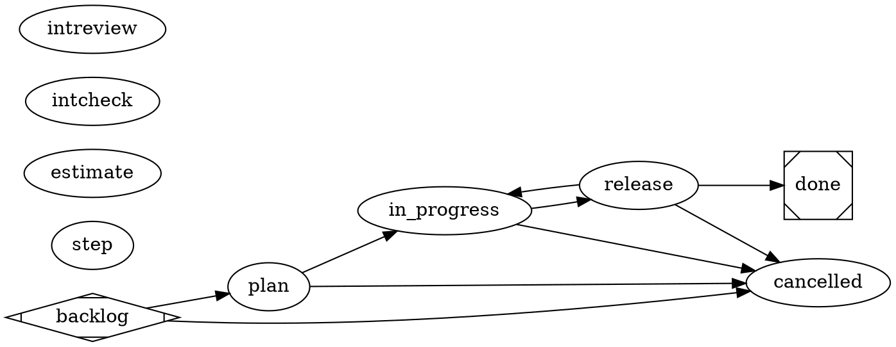

# satelle workflow (project) — the agent model, authored in DOT

> **This is a project workflow** under `.satelle/workflows`, the ACTIVE workflow
> for this repo: a project-scope workflow takes precedence over the binary's
> embedded **system** default `satelle-baseline-workflow`. See the
> `satelle-repo-agnostic` and `satelle-agent-model` principles.

The lifecycle is the **DOT graph** below — read it as the authority; this prose
only orients and must not restate it. Each node is a step carrying an `agent`.
This workflow is **reviewer-only for execution** (sty_d9a0b573): `in_progress`
and `release` carry `agent=executor`, so the **in-loop driving session** performs
them with full context and the session's own permissions — no isolated executor
sub-process is spawned for integration/commit/push, which is what previously lost
context and hit narrow-grant permission walls. A **reviewer** node only gates
*entry* via its `prompt="@skill:NAME"` (read-only — it judges, never mutates).
Status advances only through a reviewer's accept.

The **one dispatched step is `plan`**: it is allocated to a named agent
(`agent=planner`, a cheap FABLE model in `.satelle/agents.toml`) that reads the
story, writes an implementation plan covering every acceptance criterion, and
attaches it to the story — so the implementer works from a self-contained plan.

Two things the edges don't show. **There is no deploy state** — pushing to `main`
IS the release, verified by CI. And the **always-on gates are declared, not
injected**: the edge-less reviewer nodes `estimate` (`on="in_progress,done"`),
`intcheck` and `intreview` (`on="release"`) run on the transitions their `on=`
names, so the DOT is the sole gating authority. `estimate` requires a plan
estimate entering `in_progress` and an actual entering `done`; `intcheck` runs
`make integration` and `intreview` judges the tests entering `release`. The
`release -> in_progress` edge is recovery: a release/done reject returns the story
to work to fix and re-traverse, never bypass.


```dot
digraph satelle_workflow {
  graph [goal="Drive a story to done — plan reviewed against the ACs, implemented in-loop, released and verified by CI, every gate accepted", vars="story, repo_root"]
  rankdir=LR

  backlog     [shape=Mdiamond]
  plan        [agent=planner, prompt="@skill:plan"]   // DISPATCHED to the fable planner
  in_progress [agent=executor]                          // in-loop: the session implements
  release     [agent=executor]                          // in-loop: the session commits+pushes+records
  done        [shape=Msquare]                           // terminal (release-review gates the edge in)
  cancelled   [agent=reviewer, prompt="@skill:satelle-story-cancel-review"]

  // step opts this workflow into per-transition step summaries (sty_9a139c78):
  // an edge-less declaration, mandatory so a summary failure is surfaced.
  step        [agent=reviewer, prompt="@skill:satelle-step-summary", mandatory=true]

  // Declared scoped reviewers (edge-less, on="<target states>"): always-on gates the
  // workflow itself declares. estimate gates begin-work + close; intcheck runs
  // `make integration` and intreview judges test adequacy, both entering release.
  estimate    [agent=reviewer, prompt="@skill:satelle-estimate-actual-review", on="in_progress,done"]
  intcheck    [agent=reviewer, prompt="@skill:satelle-integration-check", on="release"]
  intreview   [agent=reviewer, prompt="@skill:satelle-integration-review", on="release"]

  backlog     -> plan
  plan        -> in_progress [reviewer_skill="satelle-story-plan-review"]
  in_progress -> release     [reviewer_skill="satelle-code-ac-review"]
  release     -> done        [reviewer_skill="satelle-story-release-review"]

  release     -> in_progress  // recovery: a release/done reject returns to work

  backlog     -> cancelled
  plan        -> cancelled
  in_progress -> cancelled
  release     -> cancelled
}
```

## Skill resolution

Every gate/skill this workflow names resolves through the doc-index, **project
scope (`.satelle/skills`) layered over the embedded system defaults**. The
dispatched `plan` executor and the in-loop `release` executor rubrics, and the
reviewer gates (`satelle-story-plan-review`, `satelle-code-ac-review`,
`satelle-integration-review`, `satelle-integration-check`,
`satelle-story-release-review`, `satelle-estimate-actual-review`,
`satelle-story-cancel-review`, `satelle-step-summary`) are authored in this repo's
`.satelle/skills` — so there is no dangling `@skill:`/`reviewer_skill` reference
and a story drives to a terminal state without a missing-skill block. Reviewer
gates degrade to advisory only if their rubric is genuinely absent.

## Environment

```yaml
guardrails:
  always:
    - Drive an engaged item to a terminal state (done or cancelled) — don't leave work open indefinitely.
    - Give a story numbered acceptance criteria before starting, and satisfy them before moving to done.
    - Perform in_progress and release IN-LOOP as the driving session; the plan step is the only dispatched agent.
    - Bump the version + commit + push + record the release in the single in-loop release step; the release gate verifies the bump, CI, the published release, and the acceptance criteria before close.
  ask_first: []
  never:
    - Place any state after done — done is always the terminal success state.
    - Self-enact a gated edge the reviewer has not accepted.
    - Mark an item done with unmet acceptance criteria, or release with a failing CI run.
    - Spawn an isolated sub-process to perform in_progress or release — execution is in-loop; only plan dispatches.
```
