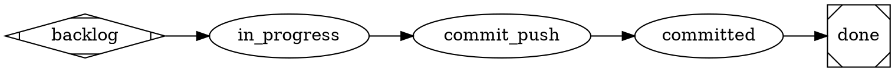

# Satelle — Design: the agent model

How satelle governs agent-driven work: the **agent** operating premise,
the **DOT** workflow format, and how reviewers run — and where each lives in the
code. Here **agent** is the step's **performer role** (`executor`/`reviewer`),
distinct from the **agent CLI** (claude|codex, selected by `satelle agent`) that a
step runs on. For the storage/port architecture see
[architecture.md](./architecture.md); for the product framing see [spec.md](./spec.md).

## Design premise

satelle's job is **quality management of agent-driven work**. The agent does the
work; satelle decides when a unit of work may advance. The whole product reduces to
one enforced thing — **a reviewer's accept on a status transition** — and everything
else (the lifecycle, the gates, the opinions) is **authored configuration**, not
code. Change the substrate, change the process; no binary release.

A story (or task) is `done` only when its **status** says so, reached through every
gate the active workflow declares. Status is the sole proof of done — not "code
written" or "tests pass locally".

## Architecture in one seam

Both the CLI and the web server reach data through one **verb registry**
(`internal/verb`), and status transitions pass through one **gater**
(`internal/reviewer`). Nothing else gates.

```
CLI / web  ─→  verb.Dispatch  ─→  store          (read/write work items)
story set <status>  ─→  reviewer.Gater.Gate  ─→  accept ? enact : block
```

- **Work items**: `internal/workitem` (stories + tasks, one kind-partitioned store).
- **Evidence**: `internal/ledger` (append-only log of what happened).
- **Authored substrate**: markdown on disk (workflows, skills, principles,
  documents), synced into a SQLite index by `internal/docindex`.
- **The gate**: `internal/reviewer.Gater` resolves the active workflow for a work
  item's category, finds the reviewer(s) governing the requested edge, runs them,
  and returns an accept/reject the verb layer enacts.

## Core reviewer operating premise

A workflow is a graph of **steps**, each run by a **defined agent role** with a
bounded grant:

- **executor** — the agent. It does the work, mutates the working tree, and requests
  the next status. Full tool grant.
- **reviewer** — **limited to reviewing**. An isolated, fresh-context judge that reads
  the requested transition and returns one verdict
  `{"decision":"accept"|"reject","notes":"…"}`. It is **read-only** and never mutates
  — a quality-management invariant enforced by its *grant*, not by trusting the agent.

satelle is the **gatekeeper of status**: a status advances only through a reviewer's
accept, and *always* through it. Accept enacts the transition; reject blocks it and
pushes the notes back to the executor, which fixes in place and retries the same
forward edge. The forbidden move is routing *around* a gate (patching a status,
relabelling to dodge an edge). This is the
`satelle-agent-model` principle (`internal/config/substrate/principles`).

The old "reviewer-only" framing made only the reviewer first-class and left the
executor an unenforced guide; the agent model **defines both** agent roles and
their grants, so the boundary is enforced rather than hoped.

### Two gate kinds

- **LLM reviewer** — the skill's markdown body rides as a fresh-context agent's
  system prompt; the agent returns the verdict (judgment: structure, intent,
  acceptance).
- **Functional check** — a self-contained ` ```check ` script embedded in the skill
  (or a `check:` in frontmatter). Run in the repo root; **exit 0 accepts, non-zero
  rejects** with the output tail as notes. No LLM — the command is the decision. Like
  the commit-push gate, a functional check may run real mechanism. Implementation:
  `Gater.runReviewer` / `runCheck` in `internal/reviewer/reviewer.go`.

## Flexible DOT workflows

Workflows are authored substrate in the **DOT standard** (Graphviz), parsed once by
`internal/wfdot` and shared by the diagram, the gater, and the commit/edit hooks (no
divergent copy). The model is **node-centric**:

- each **node** is a step carrying an `agent` (`executor`/`reviewer`); the legacy
  `actor` keyword still parses;
- a **reviewer node** names its gate inline: `prompt="@skill:NAME"`. The edge *into* a
  reviewer node is the gated transition;
- an **edge** may also carry an explicit gate: `a -> b [reviewer_skill="NAME"]` — the
  edge-centric form, needed when the gated target is an *executor* node (e.g. the
  intent gate on `backlog → in_progress`). Edge skill wins over the node-derived gate;
- `backlog` (`shape=Mdiamond`) is the start, `done` (`shape=Msquare`) the terminal.



The lifecycle **statuses** are the node names; the executor states (where commits and
edits are allowed) are the `agent=executor` nodes. The embedded
`satelle-baseline-workflow` (`backlog → in_progress → done`) is the order-zero default;
a repo overrides it under `.satelle/workflows`.

**Authoring is flexible — DOT is the stored standard, YAML is accepted input.** When a
workflow is created or uploaded, `docindex.upsert` normalizes it: `wfdot.ToDOT` parses
an inline-YAML `states:`/`transitions:` lifecycle, emits an equivalent edge-centric DOT
graph, and rewrites the source file in place (preserving frontmatter, prose, and other
YAML blocks like guardrails). A DOT workflow is returned unchanged — the conversion is
idempotent.

**Validation.** `wfdot.Validate` is a deterministic graph check (run by
`satelle validate` on DOT workflows): states present, no dangling edge endpoints, a
terminal exists, `done` is terminal, and every path into `done` carries the mandatory
**spine gate** `satelle-story-done-review` — a custom workflow cannot drop the close
gate. The structure reviewer (`satelle-workflow-review`) accepts either grammar.

Pointers: `internal/wfdot/wfdot.go` (`Parse`, `Validate`, `ToDOT`), the diagram in
`internal/web/workflow.go`, gating in `internal/reviewer/reviewer.go`
(`reviewerSkillsFor`), executor states in `internal/cli/cmd_hook.go` (`executorStates`).

## How a reviewer runs — isolated, fresh-context review

A gate is **one isolated `agent -p` call** (or a deterministic functional check) —
not a recursive or multi-step decomposition. satelle builds a small payload, spawns
a fresh-context agent with the skill as its system prompt and a read-only grant, and
parses one verdict:

```go
// internal/reviewer/reviewer.go — runReviewer
payload := transitionPayload{Story: item, From: ..., To: ..., ReviewSkill: skill}
out, _ := g.runner.Run(ctx, agentcli.Request{
    SystemPrompt: skillBody,        // the step's skill = the rubric
    Payload:      payload,          // the work item + the requested transition (FIXED)
    AllowedTools: "Read,Grep,Glob", // the reviewer's read-only grant
    Dir:          g.repoRoot,
})
dec, _ := parseDecision(out)        // one {decision, notes}, aggregated to gate status
```

Two things follow. First, **satelle does the context selection** — it constructs the
payload (the work item + the transition), so the reviewer is *not* asked to codify a
context-retrieval pipeline; it reads what it needs through ordinary read-only tools.
Second, each invocation is a **clean room** — fresh context, no shared state — which is
what makes the verdict isolated and reproducible. There is no REPL, no model-driven
context decomposition, and no recursive LM sub-calls; depth is one. (The model is
structural — agents gate agents — not a claim about recursive language-model
decomposition.)

## The agents layer — binding how a step runs

*What* is injected (the skill + context subset) is satelle's; *how and where* an agent
role runs is the **agents layer**, `.satelle/agents.toml` (`internal/config/agents.go`).
It binds each role to a backend (an agent CLI / harness) and grant (tools/model),
defaulting to today's behaviour:

```toml
[executor] harness = "in-loop"                              # the driving agent
[reviewer] harness = "claude";  tools = "Read,Grep,Glob"    # isolated, read-only preset
```

The reviewer **harness is a command TEMPLATE**, not just a CLI name: the first token
is the binary, the rest are argv tokens that may carry the placeholders `{system}`
(the gate/skill body), `{tools}` (the grant), and `{model}`. satelle substitutes each
into its own argument (so a multi-line system prompt stays one arg) and pipes the
payload on stdin. A **single-token** harness (`claude`) expands to that CLI's built-in
preset; a **multi-token** harness is taken verbatim, so a repo can point at *any* agent
CLI by writing its full argv — no Go change:

```toml
[reviewer] harness = "claude -p --disallowedTools Write,Edit,Bash --append-system-prompt {system} --allowedTools {tools}"
```

The `claude` preset carries a `--disallowedTools` denylist, so the read-only grant is a
**ceiling** (deny wins over allow) over whatever the repo's `.claude/settings.json`
would inherit — not merely an allowlist floor. An absent file is exactly today's
behaviour.

What is **wired today**: the reviewer's tool grant (`SetReviewerTools`) and its harness
template — `app.go` resolves the harness via `agentcli.RunnerFromHarness` and sets the
resulting runner on the `Gater` (`SetRunner`). `claude` works end-to-end; `codex` is a
**selectable preset stub** until its headless argv is mapped (a repo can use codex today
by supplying a full template). The executor still runs in-loop. The harness is a local
subprocess — the "remote" in play is only the model that CLI calls; satelle does not run
agents on remote machines.

## Implementation map

| Concern | Where |
|---|---|
| Status gating (the one enforced thing) | `internal/reviewer/reviewer.go` (`Gater.Gate`, `runReviewer`, `runCheck`, `reviewerSkillsFor`) |
| DOT parse / validate / YAML→DOT convert | `internal/wfdot/wfdot.go` (`Parse`, `Validate`, `ToDOT`) |
| Normalize-to-DOT at ingest | `internal/docindex/docindex.go` (`upsert`) |
| Agents layer (backend + grant) | `internal/config/agents.go`, wired in `internal/cli/app.go` |
| Executor-state hooks (engaged = can edit/commit) | `internal/cli/cmd_hook.go` (`executorStates`, `storyEngaged`) |
| Workflow diagram (web) | `internal/web/workflow.go` |
| Embedded substrate (defaults) | `internal/config/substrate/{workflows,skills,principles}` |

See `satelle help reviewer-checks` for the live gate descriptions, and the
`satelle-agent-model` and `satelle-dot-standard` principles.
