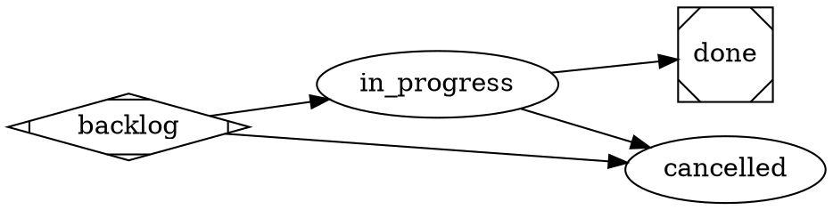

# Baseline workflow (order-zero, gated, DOT)

The default lifecycle the satelle binary ships, authored in the **DOT standard**
(node-centric — see the `satelle-recursive-actor-model` principle): a story or task
moves **backlog → in_progress → done** and may exit early to **cancelled**. Each
gate is an isolated reviewer; the executor never enacts its own transition —
quality management is the point. This is the minimal order-zero lifecycle; a repo
layers richer steps (e.g. a commit-push gate) in its own project workflow.



## Environment

```yaml
guardrails:
  always:
    - Drive an engaged item to a terminal state (done or cancelled) — don't leave work open indefinitely.
    - Give a story/task numbered acceptance criteria before starting, and satisfy them before moving to done.
    - When work stalls, set status to blocked with a note on what it's waiting on, rather than leaving it silently in_progress.
  ask_first: []
  never:
    - Self-enact a transition the reviewer has not accepted.
    - Mark an item done with unmet acceptance criteria.
```
