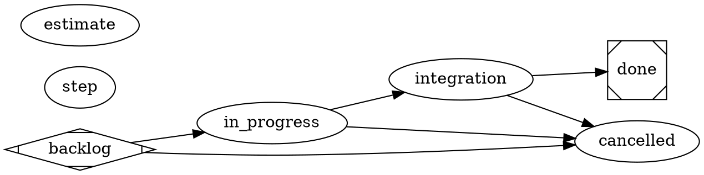

# satelle project workflow (default) — the agent model, authored in DOT

> **This is the seeded default project workflow.** `satelle init` materialises it
> into `.satelle/workflows` as editable substrate: edit it to layer your repo's
> own delivery steps (commit/push gates, deploy checks) on top. See the
> `satelle-agent-model` and `satelle-repo-agnostic` principles.

The lifecycle is the **DOT graph** below — read it as the authority; this prose
only orients and must not restate it. Each node is a step carrying an `agent`: an
**executor** does the work and mutates the tree; a **reviewer** node gates entry
via its `prompt="@skill:NAME"` (read-only — it judges, never mutates). Status
advances only through a reviewer's accept.

The always-on gates are **declared, not injected**: the edge-less reviewer node
`estimate` (`on="in_progress,done"`) runs on the transitions its `on=` names, so
the DOT is the sole gating authority. It requires a plan estimate entering
`in_progress` (`satelle story estimate`) and an actual entering `done`
(`satelle story actual`). There are deliberately **no release mechanics** here —
no version bump, CI watch, or deploy state. A repo that ships code layers those
steps into this file itself.



## Skill resolution

Every gate this workflow names resolves through the doc-index, project scope
(`.satelle/skills`) layered over the embedded system defaults. `satelle init`
seeds each referenced reviewer skill beside this file, so there is no dangling
`@skill:`/`reviewer_skill` reference on a fresh repo. Reviewer gates degrade to
advisory only if their rubric is genuinely absent.

## Environment

```yaml
guardrails:
  always:
    - Drive an engaged item to a terminal state (done or cancelled) — don't leave work open indefinitely.
    - Give a story numbered acceptance criteria before starting, and satisfy them before moving to done.
  ask_first: []
  never:
    - Place any state after done — done is always the terminal success state.
    - Self-enact a gated edge the reviewer has not accepted.
    - Mark an item done with unmet acceptance criteria.
```
