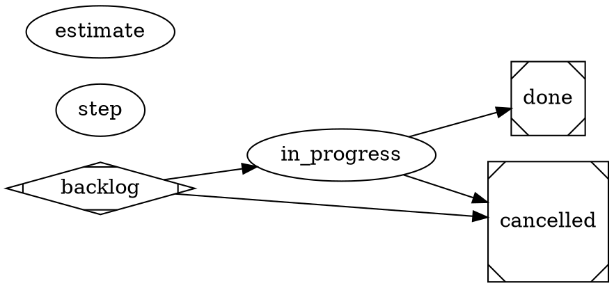

# satelle project workflow (default) — the most basic lifecycle

> **This is the seeded default project workflow.** `satelle init` materialises it
> into `.satelle/workflows` as editable substrate: edit it to layer your repo's
> own reviewer gates and delivery steps (intent/code reviews, commit/push gates,
> deploy checks) on top. See the `satelle-agent-model` and
> `satelle-repo-agnostic` principles.

The lifecycle is the **DOT graph** below — read it as the authority; this prose
only orients and must not restate it. A story moves **backlog → in_progress →
done** and may exit early to **cancelled**. The edges carry **no reviewers** —
transitions enact directly. Two declared, edge-less nodes are the only
machinery:

- **estimate** (`on="in_progress,done"`) — a **coded** gate (the skill carries a
  deterministic functional check, no agent involved): entering `in_progress`
  requires a plan estimate (`satelle story estimate`), entering `done` requires
  the actual (`satelle story actual`).
- **step** — the mandatory per-transition step summary.

There are deliberately no release mechanics and no LLM reviewers here. A repo
that wants gated quality management authors its gates into this file itself.



## Skill resolution

The two skills this workflow names — `satelle-estimate-actual-review` (the coded
check) and `satelle-step-summary` — are seeded by `satelle init` beside this
file, so nothing dangles on a fresh repo.

## Environment

```yaml
guardrails:
  always:
    - Drive an engaged item to a terminal state (done or cancelled) — don't leave work open indefinitely.
    - Record a plan estimate before beginning work and the actual cost before closing.
  ask_first: []
  never:
    - Place any state after done — done is always the terminal success state.
    - Mark an item done with unmet acceptance criteria.
```
