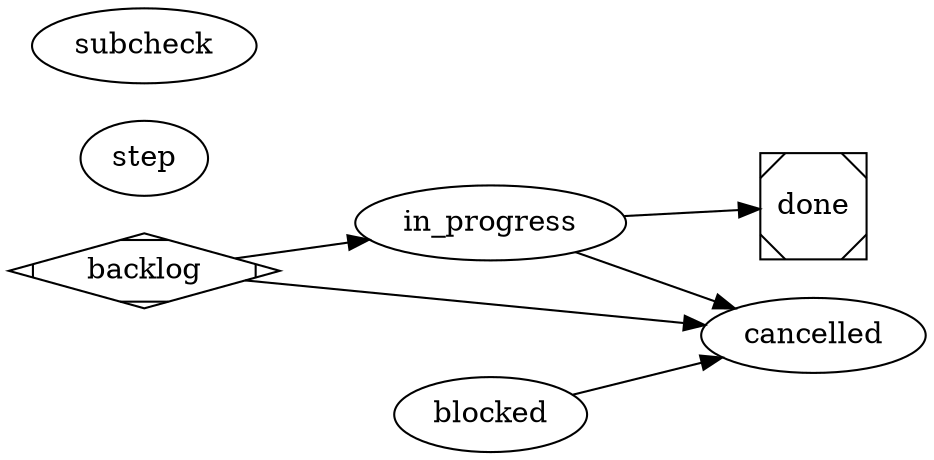

# satelle substrate workflow — track a markdown-only change without code ceremony

A **substrate change** — an edit to the authored markdown under `.satelle/`
(workflows, skills, principles, documents, tasks) or `docs/` — has a slice to
commit but **no code**. Forcing it through the project workflow's plan → code-ac
→ integration → version-bump → release path is ceremony a doc edit does not earn.
This workflow gives it a **minimal, category-selected** lifecycle, authored in the
**DOT standard** (node-centric — see the `satelle-agent-model` principle):
**backlog → in_progress → done**, with an early exit to **cancelled**.

Two things make it distinct from the project workflow, both because substrate is
not code:

- **No version bump, no release.** A markdown edit leaves the binary unchanged, so
 no `.version` bump and no `v<version>` tag/CI release are cut. The commit lands
 on `main` and the running service picks it up on its next reindex — no redeploy.
- **The close is the only gate, and it is DETERMINISTIC.** `in_progress → done`
 runs `satelle-substrate-only-check` — a self-contained functional check that
 inspects the story's change set (recorded + working tree + any commit naming it) and **rejects if any non-substrate path was
 touched**. This is the guardrail your category choice rests on: because the
 category (`substrate`) selects this lighter workflow, an agent could mis-file a
 *code* change here to skip the project workflow's gates — the check catches it,
 because the diff itself betrays the code. The category is the choice; the check
 keeps it honest.

`in_progress` **engages** the story so the agent authors the edit in-loop. Where
the repo tracks substrate in git, **commit + push while engaged** (the commit
gate refuses a commit with no engaged story). Repos that git-ignore `.satelle/`
(hosted `[sync] personal` continuity) close via the recorded/live change set
without a commit. The mandatory `step` node records a
per-transition summary, so the change is tracked in satelle's ledger as well as in
git. `backlog → in_progress` is ungated — there is nothing to plan or estimate.



## Environment

```yaml
guardrails:
 always:
 - Use this workflow only for substrate-only changes (.satelle/ and docs/ markdown); a change that touches code belongs on the project workflow.
 - Where the repo tracks substrate in git: commit + push the slice IN-LOOP while engaged (the commit gate refuses a commit with no engaged story). Repos that git-ignore .satelle/ close via the change-set channels without a commit.
 - Record the change through the mandatory step summary so it is tracked in satelle and git.
 ask_first: []
 never:
 - Bump .version or cut a release for a substrate-only change — the binary is unchanged.
 - Place any state after done — done is the terminal success state.
 - Ride a code change on this workflow to skip the project workflow's gates — the close check rejects a non-substrate slice.
```
