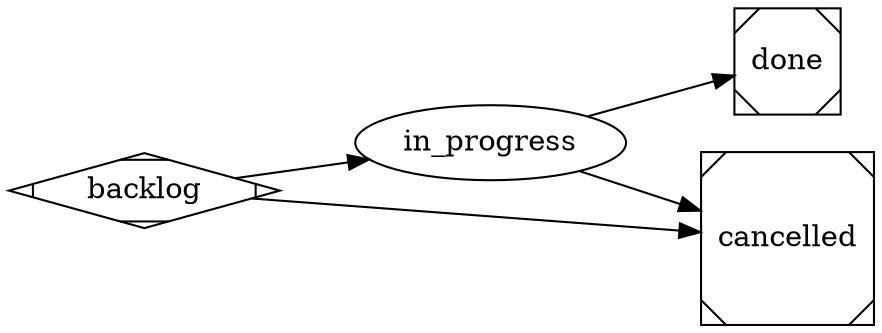

# satelle task-execution workflow — the agent model, authored in DOT

> **This workflow governs a task execution** — one isolated RUN of a task (the
> task header itself is a stable authored work-definition, not a running item).
> An execution resolves to this workflow by its KIND (`applies_to:
> ["execution"]`), so a run is never gated by the wildcard story workflow. See
> the `satelle-agent-model`, `satelle-done-is-last`, and `satelle-repo-agnostic`
> principles.

The lifecycle is the **DOT graph** below — read it as the authority; this prose
only orients and must not restate it. Each node is a step carrying an `agent`: an
**executor** does the work and mutates the tree; a reviewer gates an edge via its
`reviewer_skill` (read-only — it judges, never mutates). Status advances only
through a reviewer's accept.

Two reviewer gates bracket the run and are the ONLY gates: the begin-run edge
(`backlog → in_progress`) is gated by **satelle-task-validate-before-review** —
the run is a well-formed execution of a valid task (its parent task exists and
declares an ACTION and how success is VERIFIED); the close edge
(`in_progress → done`) is gated by **satelle-task-validate-after-review** — the
ACTION was carried out and its VERIFICATION is satisfied. There is **no** commit,
push, release, estimate, or integration machinery — an execution is a
work-definition run, not a shippable code slice. The executor working while
`in_progress` MAY be a named `agents.toml` agent (the run's declared executor).

`done` is the **terminal** success state (satelle-done-is-last): it has no
outgoing edge, and a completed run is never moved backward. "Re-running" a task is
a NEW execution, created fresh at `backlog` — not a reopen of a done run.



## Skill resolution

The two gate reviewers this workflow names —
`satelle-task-validate-before-review` and `satelle-task-validate-after-review` —
are seeded by `satelle init` into `.satelle/skills` beside this file, so there is
no dangling `reviewer_skill` reference and a run drives to `done` without a
missing-skill block. Reviewer gates degrade to advisory only if their rubric is
genuinely absent.

## Environment

```yaml
guardrails:
  always:
    - Drive an engaged execution to a terminal state (done or cancelled) — don't leave a run open indefinitely.
    - A run declares its ACTION and how success is VERIFIED before it begins, and satisfies both before it closes.
  ask_first: []
  never:
    - Place any state after done — done is always the terminal success state; re-running a task is a NEW execution, never a backward move of a done run.
    - Self-enact a gated edge the reviewer has not accepted.
    - Mark a run done with its ACTION unaddressed or its VERIFICATION unmet.
```
